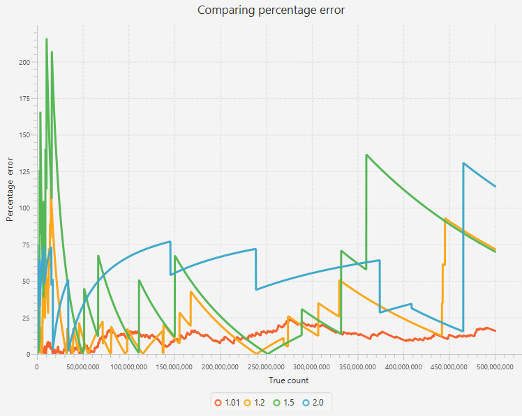

# Dynamic visualisations of the performance of streaming algorithms

This library provides user-written implementations of three well-known streaming algorithms: the MorrisCounter for 
approximate counting; the KMV algorithm for distinct counting; and the Count-Min Sketch for frequency counting.

Approximate Counting

- An implementation of the Morris Counter, based on Morris' counting algorithm
- An implementation of a basic approximate counter
- A collection of dynamic visualisations testing the real-world performances of both the Morris and basic approximate counter

Distinct Counting

- An implementation of the k-Minimum Values (KMV) algorithm
- A collection of dynamic visualisations testing the real-world performance of the KMV, including against implementations of other streaming algorithms - HyperLogLog (HLL) and Compressed Probabilistic Counting (CPC) developed by Apache DataSketches
- More tests to measure the performance of the HLL and CPC

Frequency Counting

- An implementation of the original Count-Min Sketch
- An implementation of the Count-Min Sketch with Conservative Update
- An implementation of the Count-Mean-Min Sketch, an attempt to remove the bias from the sketch's estimates
- A dynamic visualisation comparing the performance of these algorithms 

